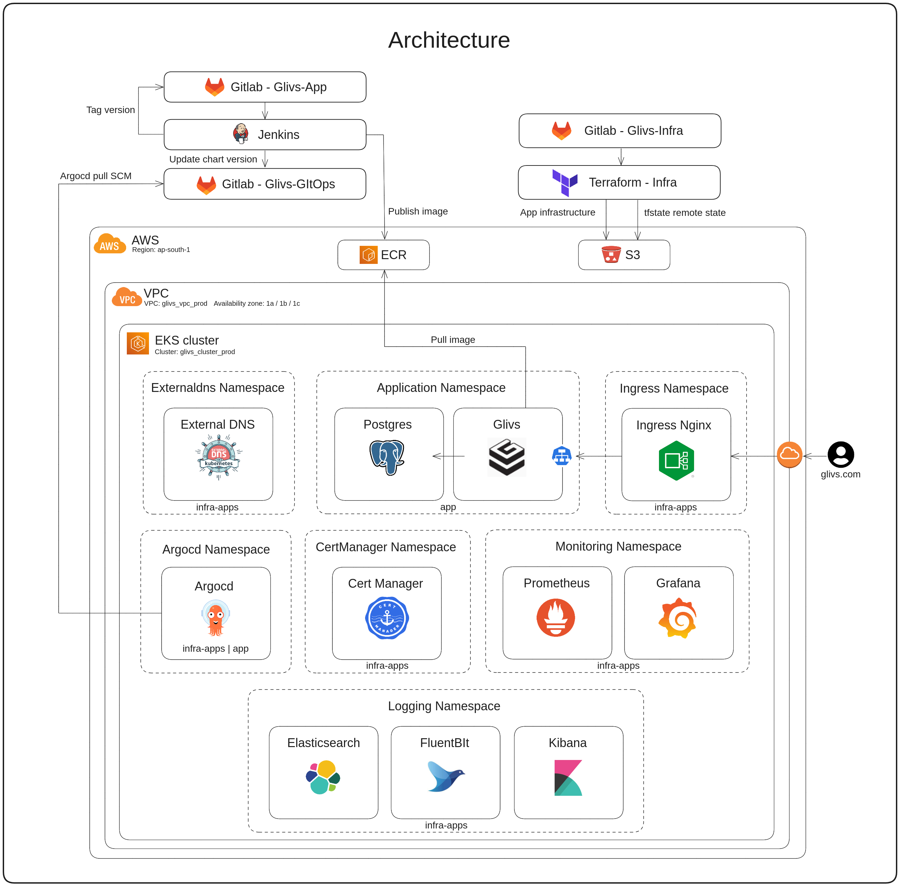

# Exptracker (Glivs) Infrastructure - Financial Management Application

This application is a full-stack application designed to help users manage their finances. Users can sign up, log in, view their financial data, add expenses, and delete expenses. The application is built with a Docker Compose configuration for easy deployment and uses PostgreSQL as the database.

## Architecture Overview

## Contributing

We welcome contributions to this project. Please see the `CONTRIBUTING.md` file for guidelines on how to contribute.

## License

This project is licensed under the MIT License. See the `LICENSE` file for details.